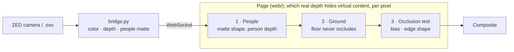

# ZED + three.js occlusion prototype

A ZED 2i streams color and depth to the browser. three.js draws the video as a background and renders
3D content on top, hidden wherever the real world stands in front of it, so people walk _in front of_
virtual objects.

## How it works



**The bridge** (`bridge.py`) reads the ZED, or a recording, and sends each frame to the page:

- the left color image (1280×720 JPEG);
- the depth map (640×360 or 1280×720, in millimeters);
- with matting on, the people's alpha matte, computed by Robust Video Matting (`matting.py`);
- with detection on, the objects the ZED SDK detects (see Object Detection below; not part of occlusion).

**The page** works out, for every pixel, the real depth that should hide virtual content. Stage 1 runs as one GPU
pass (`Occluder.ts`), and stages 2–3 run inside the virtual materials (`Occlusion.ts`).

Each stage's folder in the pane starts with its on/off toggle (_Occlusion_ comes first, right after the inputs):
turn stages off one by one to see what each contributes. The **Video › view** dropdown has a debug view for most stages.

### 1 · People: shape from the matte, order from depth

- **Problem:** depth gets people's outlines wrong: holes, blocky edges, halos (stereo depth spreads foreground outward).
- **How:** the bridge cuts people out of the video with Robust Video Matting. A person is taken out of the depth and gets
  a _person depth_ from the depth pixels inside their matte. A person hides virtual content behind them with the
  matte's alpha as coverage, so their edges are as soft as the matte's (hair, hands). Next to a person, depth at about
  their depth is their halo, and is taken out too. Everything that isn't a person (props, furniture) occludes with its
  live depth.
- **Controls** (_Robust Video Matting_):
  - **enable**: the bridge computes the matte, about 12 ms per frame at 640×360 on an RTX 3060 laptop GPU. Unticked,
    the other controls are disabled, since they have no effect. The whole folder is disabled when ONNX Runtime or the
    model is missing (the bridge prints why).
  - **use matte**: the page uses the matte, or ignores it, to compare.
  - **resolution**: the size of the image RVM gets; 1280×720 gives sharper edges, at about twice the cost.
  - **matting ratio**: the share of that size RVM works at internally. Higher finds smaller (farther) people, but is slower.
- **See it:** the _Robust Video Matting_ view shows the raw matte (white = person).
- **Limits:** RVM is made for video where people are the main subject, so it misses small or distant people (under
  about 100 px tall). Where feet meet a plane on the ground, their depths are too close to tell which is in front, so the
  plane may draw over shoes. RVM is licensed under the GPL-3.0.

### 2 · Ground: the floor never occludes

- **Problem:** the floor's own depth noise hides virtual content lying on it (a plane on the floor gets eaten in
  patches).
- **How:** a real point less than the **ground margin** above the recording's ground plane never hides anything. The
  ground is the plane marked **ground** in the recording's _Planes_ folder. **Detect ground plane** adds one from the
  floor the ZED SDK finds, already marked (see Placing planes).
- **Controls** (_Ground_): **ground test** (on/off) and **ground margin (m)**.
- **See it:** _Ground_ view: green is within the margin and never occludes. The floor should be green, people and
  objects not.
- **Limits:** within the margin, the bottom of shoes and wheels no longer hides a plane on the ground.

### 3 · Occlusion test

- **How:** a virtual fragment is hidden where the real depth (from stages 1–2) is closer than it by more than the
  **bias**. The depth is lower resolution than the screen, so cutting along its pixels gives stair-steps. Instead, the
  test's answers (hidden or not) at the depth pixels around the fragment are blended into a smooth field, and the
  fragment is hidden where it's above one half: the outline is a smooth curve through the stair-steps, still crisp.
  - **edge shape**: _Smooth_ (default: the 16 nearest depth pixels, with cubic B-spline weights; very thin parts and
    sharp corners get slightly rounder), _Linear_ (the 4 nearest: chamfered corners) or _Pixels_ (the nearest only:
    the stair-steps).
  - **edge softness (px)**: how many screen pixels the cut is antialiased over: 1 by default, 0 for aliased edges.
  - A higher **ZED depth › resolution** (1280×720) halves the size of the steps, whatever the shape.

  Transparent materials fade through their opacity; opaque ones use alpha-to-coverage, with the renderer's
  antialiasing.
- **Controls** (_Occlusion_): **occlusion** (on/off), **bias (m)**, **edge shape**, **edge softness (px)**.
- **See it:** _Composite_ (the final render), and _Depth only_: the depth used, as a colormap (red is near, blue is
  far, dark purple is beyond the ZED's range of about 20 m, black is unknown). People are excluded from it.

### ZED depth (input)

The ZED SDK settings the bridge computes depth with. Each change applies when you release the control, and the bridge
shows the same frame again with it, so you can compare settings while paused. The defaults are at the top of
`bridge.py` (`DEPTH_SETTINGS`); the bridge keeps changes until it restarts.

- **mode**: NEURAL_LIGHT (fastest), NEURAL or NEURAL_PLUS (sharpest edges, slowest).
- **stabilization** (0–100): smooths depth over time where the scene is static.
- Changing **mode** or **stabilization** reopens the recording, which takes a second or two, at the same frame.
- **confidence** (1–100): lower removes more uncertain pixels, mostly along object edges.
- **texture conf.** (1–100): lower removes more pixels in plain, textureless areas.
- **fill holes**: gives every pixel a depth (no black in _Depth only_), with guessed values in the holes.
- **drop saturated**: removes pixels in over-exposed areas.
- **resolution** of the depth map sent to the page: 640×360 or 1280×720 (the video's resolution).
- **camera resolution** and **camera fps** (live camera only, hidden for recordings): what the ZED captures, from VGA
  (672×376, up to 100 fps) to HD2K (2208×1242, 15 fps only); the fps dropdown lists what the resolution allows. The
  video sent is always 1280×720, but depth is computed at the capture resolution: higher is sharper, and slower.
  Changing either reopens the camera, which takes a second or two. The default is HD720 at 30 fps.

### Object Detection (ZED SDK, not part of occlusion)

The bridge runs the ZED SDK's object detection on each frame and sends what it finds with that frame, so the objects
always match the video and depth shown. The page draws each one as a 3D or 2D box with its label and tracking id (people in
magenta, vehicles in cyan, anything else in yellow).
The boxes are drawn over everything: they show what the bridge sees, and aren't part of the scene.

- **Per object** (`DetectedObject` in `Detections.ts`): a tracking id (stable while the object stays in view), label
  and finer sub-label (e.g. VEHICLE / BUS), confidence, tracking state, whether it's moving, and in the camera's frame
  (the scene's): position, velocity (m/s), dimensions, the 8 corners of its 3D box, and its 2D box in video pixels.
  `Detections.objects` holds the last frame's, for content that reacts to them.
- **Controls** (_Object Detection_): **enable** (the bridge detects; unticked, the other controls are disabled),
  **boxes** (page only: _3D_, _2D_ on the video's pixels, or _None_), **show mask**
  (each object's mask, in its color: the bridge computes them only while this is on, about 15 ms more per frame),
  **objects** (how many in the frame), **model**, **min confidence**. If detection can't
  start, the bridge's log says why.
  - _Multi-class_ (fast, medium, accurate): people, vehicles, bags, animals, electronics, fruit and vegetables, sports
    equipment.
  - _Heads_ (fast, accurate): people's heads only, which holds up better when people overlap.
- **Cost:** about 10 ms per frame with the fast multi-class model (measured on the street recording), about 15 ms more
  with masks.
- **See it:** the _Object Detection_ view shows all the masks in white on black, like the _Robust Video Matting_ view
  shows the matte, to compare the two. The SDK's masks are coarse (blocky, cut to each object's 2D box).
- **First use of a model:** the SDK optimizes it for the GPU, then caches it. That took under a second for the
  multi-class models here (already optimized), but the heads fast model estimated **33 minutes**, during which the
  bridge sends nothing (its log shows the progress). Switch to a new model well before you need it.
- **Limits:** with recordings, seeking, looping and switching scenes restart the tracking, so ids change. The SDK can
  also run your own detector (a YOLO-style ONNX model, or boxes you compute yourself); that isn't wired in.

## Files

- `bridge.py`: reads the ZED or a recording; sends color, depth, the objects detected and the people matte, and the
  settings on connect and after each change.
- `matting.py`: people's alpha matte for each frame, from Robust Video Matting, with ONNX Runtime on DirectML.
- `web/src/` (TypeScript), one class per feature. `App` creates and wires the others, in pipeline order.
  - `App.ts`: the renderer, the render loop, and the canvas size.
  - `Bridge.ts`: the WebSocket to `bridge.py`, the protocol types, and the playback controls.
  - `Feed.ts`: the latest frame as textures (video, depth in meters, matte), plus `sampleDepth()`.
  - `ZedSettings.ts`: the _ZED depth_ controls.
  - `People.ts`: stage 1's matte, from the bridge, and the _Robust Video Matting_ controls.
  - `Occluder.ts`: stage 1 on the GPU, at depth resolution. Its output texture is the depth that `Occlusion`
    and the debug views use.
  - `Ground.ts`: stage 2. The active recording's ground plane.
  - `Occlusion.ts`: stage 3. `apply(material)` adds the occlusion test to any built-in material, lines and points
    included.
  - `DepthView.ts`: the debug views (_Depth only_, _Ground_, _Robust Video Matting_, _Object Detection_).
  - `Detections.ts`: the objects the ZED SDK detects, drawn as 3D boxes, and the _Object Detection_ controls.
  - `ZedCamera.ts`: a three.js camera whose projection is built from the ZED intrinsics.
  - `Recordings.ts`: one `THREE.Scene` per recording, and loading `default-planes.json`.
  - `Plane.ts`: one plane, with its mesh, its gizmo and its controls.
  - `PlaneTool.ts`: placing planes with 4 clicks, and the keyboard shortcuts.
  - `Debug.ts`: the Tweakpane pane and the Stats panel. Set `SHOW_DEBUG` to `false` to hide all controls.
  - `Status.ts`: the status line at the bottom-left.
  - `Timestamps.ts`: the timestamp buttons under Play, and logging the frame paused on.
  - `Sensor.ts`: the stand-in sensor and its laser curtain, and the _Sensor_ controls.
  - `Spheres.ts`: the grid of bobbing spheres on the floor, and the _Spheres_ controls.
- `web/public/default-planes.json`: the planes created on load, per recording (see Planes below).
- `web/public/timestamps.json`: the timestamps listed under Play, per recording, as SVO frame numbers.
- `web/public/sensors.json`: the sensor's placement and settings, per recording.
- `vite.config.ts`: Vite serves `web/` on port 8000. `yarn typecheck` runs the TypeScript checker.

## Setup (once)

1. Install the **ZED SDK** for Windows (it installs CUDA if needed). Update the NVIDIA driver first.
2. Create the venv and install the Python dependencies:
   ```
   py -3.10 -m venv .venv
   .venv\Scripts\python -m pip install -r requirements.txt
   ```
   If pip fails with `CERTIFICATE_VERIFY_FAILED` (HTTPS inspection on this machine), download the wheels with the newer system pip, then install offline:
   ```
   py -3.14 -m pip download --python-version 3.10 --only-binary=:all: --platform win_amd64 -d wheels -r requirements.txt
   .venv\Scripts\python -m pip install --no-index --find-links wheels -r requirements.txt
   ```
3. Install `pyzed` into the venv using the script that ships with the SDK:
   ```
   .venv\Scripts\python "C:\Program Files (x86)\ZED SDK\get_python_api.py"
   ```
   If that fails (it needs `requests` and internet access through pip), do its steps by hand. Example for SDK 5.5 and Python 3.10:
   ```
   curl.exe -L -o pyzed.whl https://download.stereolabs.com/zedsdk/5.5/whl/win_amd64/pyzed-5.5-cp310-cp310-win_amd64.whl
   .venv\Scripts\python -m pip install --no-deps pyzed.whl
   copy "C:\Program Files (x86)\ZED SDK\bin\sl_ai64.dll" .venv\Lib\site-packages\pyzed\
   copy "C:\Program Files (x86)\ZED SDK\bin\sl_zed64.dll" .venv\Lib\site-packages\pyzed\
   ```
   Repeat this after every ZED SDK update.
4. Download the people matting model (optional: without it, the bridge runs without matting):
   ```
   curl.exe -L -o models/rvm_mobilenetv3_fp32.onnx https://github.com/PeterL1n/RobustVideoMatting/releases/download/v1.0.0/rvm_mobilenetv3_fp32.onnx
   ```
   `onnxruntime-directml`, in `requirements.txt`, runs it. RVM is licensed under the GPL-3.0.
5. Install the web dependencies with Yarn (Node.js 20.19+ or 22.12+):
   ```
   yarn
   ```

The first run with each NEURAL depth mode (NEURAL_LIGHT, NEURAL, NEURAL_PLUS) downloads its AI model
and optimizes it for the GPU, which takes a few minutes. Later runs start in seconds. Object detection models do the
same the first time each is used, which can take much longer (see Object Detection above).

## Run

```
.venv\Scripts\python bridge.py      # every .svo / .svo2 in this folder, switchable from the page
yarn dev                            # Vite dev server for web/, reloads the page on edits
```

Other ways to start the bridge: `bridge.py a.svo b.svo` (only these; wildcards like `*.svo` work),
`--live` (adds the live camera). With no `.svo` or `.svo2` in the folder, it opens the live camera.

Open http://localhost:8000. If the 3D content looks stretched or shifted, check
that the browser runs on the NVIDIA GPU (Windows Graphics settings → High performance).
To use a bridge on another address or port, add `?ws=ws://host:port` to the page URL.

The bridge prints the fps it actually sends every 5 s. At 1× it should match the recording's frame rate
(15 fps for the runners SVO, 30 for the street one).

## Other controls

- **Video**: **scene** (switches the recording; takes a second or two, and the camera re-aligns to that recording's
  calibration), play/pause, **speed** (SVO only: the bridge paces playback, and a live camera runs at its own rate),
  and **view**: _Composite_ or one of the debug views described in the stages above.
  - **Timestamps**: frames of a recording to come back to, listed as buttons under Play (`1:08.4 · frame 1026`).
    Clicking one pauses on that frame. Pausing logs the frame shown to the browser console: add its number under its
    recording in `web/public/timestamps.json`, then reload the page, to list it.
- **Sensor** (hidden until **show** is ticked): a stand-in for the real sensor, to judge occlusion and try calibrating
  its placement from the camera. A
  box (**width**, **height**, **depth**: 1 m × 10 cm × 10 cm by default) with a curtain of evenly spaced lasers out of
  its bottom face, across its whole width (**lasers**: how many, **laser length**: 5 m, **laser color**), like a door
  sensor above a doorway. Both go through the occlusion test, so a person walking through the curtain cuts the lasers.
  - Place it to line up with the real sensor in the video: **edit** shows a gizmo (**mode**: _Move_ or _Rotate_, along
    the sensor's own axes), or type exact values in **position (m)** and **rotation (°)** (in the camera's frame).
  - Every change logs the sensor's definition to the browser console, labelled with its recording: paste it into
    `web/public/sensors.json` under that recording's name (`{ "<recording>": { ... } }`) to keep it. Without one, a
    recording's sensor starts 3 m in front of the camera, half a meter above it. Changes are kept per recording until
    the page reloads.
- **Spheres** (hidden until **show** is ticked): a test of occlusion against moving 3D content. A grid of spheres (**per side**: 10 × 10 by default,
  **spacing**, **radius**) on the recording's ground plane, centered on it (**offset** moves it along the floor), at
  **height** above the floor, bobbing along the floor's normal in waves: **pattern** _Ripple_ (rings spreading from the
  middle) or _Wave_ (straight crests along X), **amplitude**, **wavelength**, **speed**. Without a ground plane, it
  sits 4 m in front of the camera, 1.5 m below it. One instanced mesh, so it costs a single draw.
- **Planes**: planes belong to a recording. Each recording has its own `THREE.Scene`; only the current recording's
  scene is rendered, and only its planes are listed here, one section each, with color, alpha, thickness and Remove.
  Thickness grows from the surface toward the camera.
  - Every change logs the plane's definition to the browser console, labelled with its recording. Paste it into
    `web/public/default-planes.json`, under that recording's name, to have the plane created on load. The Unity prototype
    (`../zed-unity-prototype`) reads the same file.
  - **edit** shows a TransformControls gizmo on the plane, for one plane at a time. A new plane starts in edit mode.
    The gizmo moves the whole plane, so it always stays a rectangle.
  - **mode**: _Move_ (`W`) slides it along its own axes. _Rotate_ (`E`) turns it with the rings, or freely
    (trackball style) by dragging inside the rings, away from any of them.
  - **Reset position** puts it back where it was fitted.
  - **ground** makes this plane the recording's ground, for the ground test (at most one per recording). It is saved as
    `"ground": true`. The ground follows the plane live, so you can fine-tune it with the gizmo while watching the
    _Ground_ view.

## Placing planes

Click 4 corners in order around the outline of a rectangle, either clockwise or counter-clockwise. Each click
is lifted to 3D using the depth at that pixel (the median of a small neighborhood). The plane
is a true rectangle fitted to the 4 points: its center is their average, its sides follow the clicked edges, and
its width and height are the averages of the opposite edges. Press `Esc` to cancel the current corners.
Clicks where the ZED has no depth (sky, reflections, very close or far) are ignored.

**Detect ground plane** (in _Planes_) adds a plane on the floor instead: the bridge asks the ZED SDK to find the floor
in the current frame (`find_floor_plane`), and the page fits a rectangle around the floor it saw, its sides along the
camera's left-right and depth directions. It becomes the recording's ground (replacing any other), for the ground
test. It's a regular plane: edit it with the gizmo, and copy its definition from the console into
`default-planes.json` to keep it. The floor must be visible; if none is found, the status line says
why. On the runners recording it's about 5 × 15 m, within about 2° and 8 cm of the plane placed by hand.

## Coordinates

Everything is in the ZED left camera's frame: meters, right-handed, Y up, looking down **-Z**
(the same as three.js). Your sensor's points and boxes need to be transformed into this frame, using the
sensor-to-camera calibration.

## Recommended specs

What the experience needs to run in real time, from measurements on the prototype laptop
(RTX 3060 Laptop GPU). These are estimates: confirm the frame rate on the actual machine before the event.

| Part    | Recommendation                                                                              | Why                                                                                                               |
| ------- | ------------------------------------------------------------------------------------------- | ----------------------------------------------------------------------------------------------------------------- |
| GPU     | NVIDIA RTX 4070 Ti / 4080 or better (or the 50-series equivalent), 12–16 GB of video memory | ZED depth requires an NVIDIA GPU (CUDA). Depth, people matting and rendering all share it.                        |
| CPU     | Recent Intel Core i7/i9 or AMD Ryzen 7/9, high single-core speed                            | The bridge's loop is single-threaded Python (JPEG encoding, depth conversion, sending).                           |
| RAM     | 32 GB                                                                                       | ZED, the AI models and the browser.                                                                               |
| Storage | NVMe SSD                                                                                    | The AI models load at launch.                                                                                     |
| USB     | Native USB 3 port, on the motherboard                                                       | The ZED 2i needs USB 3 bandwidth. If the camera is far from the PC, use an active or fiber-optic USB 3 extension. |
| OS      | Windows 11                                                                                  | Matches the prototype (DirectML matting, setup steps above).                                                      |

Prefer a desktop with a single GPU to a laptop: laptops with two GPUs can run parts of the
pipeline on the slower integrated one, and slow down when hot during a full day.

Measured per frame on the prototype laptop, for reference:

- ZED NEURAL depth: about 24 ms on recordings (a live camera skips video decoding).
- People matting (RVM, 640×360 input): about 12 ms.
- Object detection (multi-class fast): about 10 ms.
- Browser passes (the Occluder's pass, the occlusion test): no measurable cost.

Before the event:

- Install the same versions as the prototype: ZED SDK 5.5, Python 3.10, Node.js.
- Let the first run download and optimize the AI models (several minutes each).
- Run the full experience for a few hours to check temperatures and frame rate.

## Parked ideas

Tried, and removed because their gain didn't justify their complexity. They're in the git history, to come back to.

- **Jagged occlusion edges** (open issue, not started): edges are still jagged with the _Smooth_ edge shape. Two causes:
  where a plane meets a wall at nearly the same depth, stereo noise makes the intersection line wobble; and close
  objects show the depth's pixels (about 3 screen pixels each at 640×360). Options, most promising first: draw the
  static set (walls, furniture) as clean invisible occluder geometry (walls detected with `find_plane_at_hit`, a
  spatial-mapping mesh, or hand-placed boxes), keep RVM for people, then upsample the remaining depth edges guided by
  the color image (joint bilateral upsampling or a guided filter); temporal smoothing and 1280×720 / NEURAL_PLUS depth
  help too.

- **Background stage** (last in commit `f787fb8`): the bridge captured the empty set (the per-pixel median of a few
  seconds of depth and color, saved in `backgrounds/<scene>.npz`), and the page used its clean depth wherever nothing
  stood clearly in front of it, or clearly behind it (something that left). An optional color test told shadows from
  objects. It removed flicker and halos on static parts of the scene, but the final render barely improved. To look at
  it again: `git show f787fb8:web/src/Background.ts` and `git show f787fb8:bridge.py` (`Capture`, `Background`), and
  this README at that commit. Backgrounds already captured are still in `backgrounds/`.
- **Temporal filter and edge snap** (last in commit `47169b9`, in `web/src/DepthFilter.ts`): the occluder depth was
  smoothed over time (a pixel had to stay foreground for a few frames), and its edges snapped to the video's color edges.
- **Holes stage** (last in commit `0fb81bb`, in `web/src/Occluder.ts`): on the page, an unknown depth pixel more than
  half surrounded by known depth, within a radius (2 px by default, up to 6), took their mean depth, so virtual content
  didn't show through gaps in real objects. It was in the Occluder's pass, with a _Holes_ folder (on/off, radius), and
  the debug view showed filled holes in yellow. The ZED SDK's own fill (_ZED depth › fill holes_) is still there.
